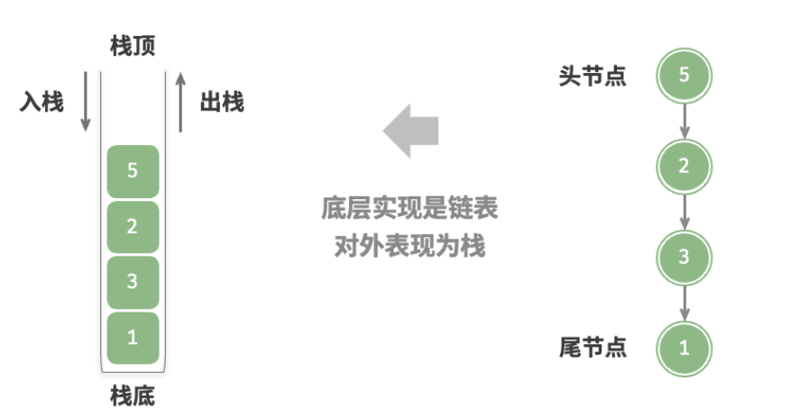
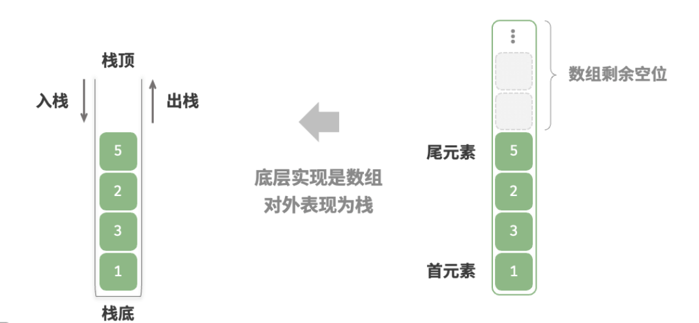
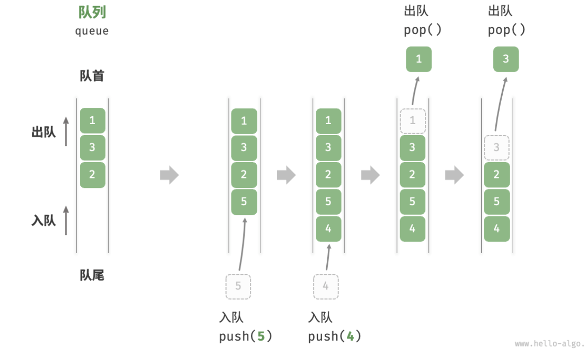

# Hello 算法 — — 栈与队列

## 5.1 栈（stack）

类比成一摞盘子，最上面的盘子就是栈顶，最下面的就是栈底。把元素添加到栈顶是入栈，删除栈顶就是出栈。

“先入后出"

### 5.1.1栈的常用操作


c语言没有内置的栈

下面拿c#举例：

shift+command+P,然后输入.net:new project

```csharp
namespace 栈的操作;

class Program
{
    static void Main(string[] args)
    {
        //初始化栈
        Stack<int> stack = new();

        //入栈
        stack.Push(1);
        stack.Push(3);
        stack.Push(2);
        stack.Push(5);
        stack.Push(4);

        //访问栈顶元素
        int peek = stack.Peek();
        //出栈
        int pop = stack.Pop();
        //获取栈的长度
        int size = stack.Count;
        //判断是否为空
        bool isEmpty = (stack.Count == 0);
      

    }
}

```

### 5.1.2 栈的实现

#### * 基于链表的实现

出入栈：头插法，也就是把元素插入/删除 链表的头节点



```c
#include <stdio.h>
#include <stdlib.h>
#include <limits.h>
#include <stdbool.h>

// 定义链表节点
typedef struct ListNode{
    int val;
    struct ListNode *next;
}ListNode;

// 定义栈结构
typedef struct{
    ListNode *top;
    int size;
} LinkedListStack;

// 初始化一个空栈
LinkedListStack* newLinkedListStack(){
    LinkedListStack *s = malloc(sizeof(LinkedListStack));
    s->top = NULL;
    s->size = 0;
    return s;
}

// 析构函数：释放栈结构
void delLinkedListStac(LinkedListStack *s){
    while(s->top){
        ListNode *n = s->top ->next;// 指针暂存下一个节点
        free(s->top);// 释放栈顶节点
        s->top = n;//栈顶指向下一个节点
    }
    free(s);// 释放栈结构，头节点可以表示栈
}

// 获取栈的长度
int size(LinkedListStack *s){
    return s->size;
}

//判断栈是否为空
bool isEmpty(LinkedListStack *s){
    return size(s) == 0;
}

//入栈
void push(LinkedListStack *s, int val){
    ListNode *node = (ListNode*)malloc(sizeof(ListNode));
    node->next = s->top;// 新节点指向栈顶
    node->val = val;

    s->top = node;  //更新栈顶
    s->size++;
}

//访问栈顶元素
int peek(LinkedListStack *s){
    if(isEmpty(s)){
        printf("栈为空\n");
        return INT_MAX;
    }
    return s->top ->val;
}

//出栈
int pop(LinkedListStack *s){
    if(isEmpty(s)){
        printf("栈为空\n");
        return INT_MAX;
    }
    int val = peek(s); 

    ListNode *temp = s->top;

    s->top = s->top->next; //删除栈顶节点

    free(temp);
    s->size --;
    return val;
}


```

#### * 基于数组的实现

栈顶：数组的尾部

出入栈： 在数组尾部增/减元素



```c
#include <stdio.h>
#include <stdlib.h>
#include <stdbool.h>
#include <limits.h>
#define MAX_SIZE 100

typedef struct ArrayStack {
    int *data;
    int size;
}ArrayStack;

//初始化一个空栈
ArrayStack *newArrayStack() {
    ArrayStack *stack =(ArrayStack *)malloc(sizeof(ArrayStack));
    stack->data = malloc(sizeof(int*)*MAX_SIZE);
    stack->size = 0;
    return stack;
}

//析构函数
void delArrayStack(ArrayStack *stack){
    free(stack->data);
    free(stack);
}

//获取栈的大小
int size(ArrayStack *stack){
    return stack->size;
}

//判断栈是否为空
bool isEmpty(ArrayStack *stack){
    return stack->size == 0;
}

//入栈
void push(ArrayStack *stack, int val){
    if(size(stack) == MAX_SIZE){
        printf("栈满\n");
        return;
    }
    stack->data[stack->size] = val;//更新栈顶：数组尾部的后面添加元素
    stack->size++;
}

int peek(ArrayStack *stack){
    if(isEmpty(stack)){
        printf("栈空\n");
        return INT_MIN;
    }
    return stack->data[stack->size-1];//返回栈顶元素
}

//出栈
int pop(ArrayStack *stack){
    int val = peek(stack);//栈顶元素
    stack->size--;
    return val;
}


```

### 5.1.4 栈的应用

**浏览器中的后退与前进、软件中的撤销与反撤销** 。

**程序内存管理**。


## 5.2 队列(queue)

先入先出

入队：队尾入队

出队：队首出队



#### * 基于链表的实现

  队首：头节点

  队尾：尾节点

```c
#include <stdio.h>
#include <stdlib.h>
#include <stdbool.h>

//链表结构体
typedef struct ListNode{
    int val;
    struct ListNode *next;
}ListNode;

//创建一个新节点
ListNode *newListNode(int val){
    ListNode *node = (ListNode*)malloc(sizeof(ListNode));
    node->val = val;
    node->next = NULL;
    return node;
}

//队列结构体
typedef struct LinkedListQueue{
    ListNode *front;
    ListNode *rear;
    int queueSize;
}LinkedListQueue;

//创建一个空队列
LinkedListQueue *newLinkedListQueue(){
    LinkedListQueue *queue = (LinkedListQueue*)malloc(sizeof(LinkedListQueue));
    queue->front = NULL;
    queue->rear = NULL;
    queue->queueSize = 0;
    return queue;
}

//析构函数（构造函数的相反操作，相当于删除原来的构造）
void delLinkedListQueue(LinkedListQueue *queue){
    while(queue->front!= NULL){
        ListNode *temp = queue->front;
        queue->front = queue->front->next;//从头节点开始删除
        free(temp);//释放头节点
    }
    free(queue);//释放最后的链表
}

//获取队列长度
int size(LinkedListQueue *queue){
    return queue->queueSize;
}

//判断队列是否为空
bool isEmpty(LinkedListQueue *queue){
    return size(queue) == 0;
}

//入队
void pop(LinkedListQueue *queue,int val){
    //入队：队尾入队

    ListNode *node = newListNode(val); //创建新节点node
    //如果队列空的话，则头节点和尾节点指向同一个节点
    if(isEmpty(queue)){
        queue->front = node;
        queue->rear = node;  
    }
    //不为空
    queue->rear->next = node;//队尾入队
    queue->rear = node;//更新队尾
    queue->queueSize++;
}

//访问队首元素
int peek(LinkedListQueue *queue){
    return queue->front->val;   
}

//出队
int pop(LinkedListQueue *queue){
    //出队：队首出队

    int val = peek(queue);
  
    ListNode *temp = queue->front;//保存原来的队首
    queue->front = queue->front->next; //队首出队
    free(temp);//释放原来的队首

    return val;
}

void printArray(int *arr,int size){
    for (int i=0;i<size;i++){
        printf("%d ",arr[i]);
    }
    printf("\n");
}
//打印队列
void printQueue(LinkedListQueue *queue){
    int *arr = (int*)malloc(sizeof(int)*size(queue));//定义一个数组用来存放后面的每个队列元素
    ListNode *node = queue->front;
    for(int i = 0; i < size(queue); i++){
        arr[i] = node->val;
        node = node->next;
    }
    printArray(arr,size(queue));
    free(arr);
}
```
