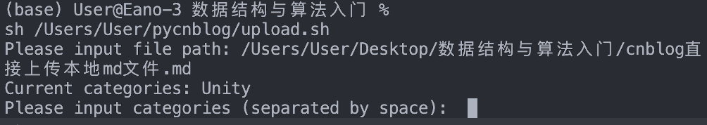
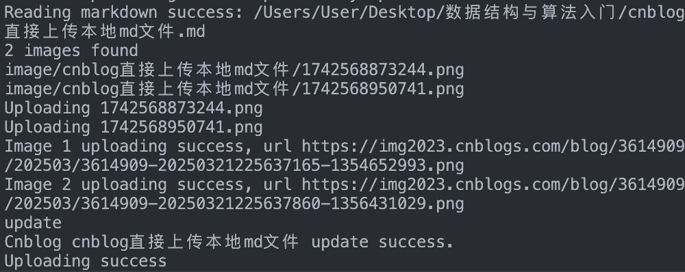

> 原文参考：[pycnblog工具](https://github.com/Shane-shy/pycnblog)
> 根据github链接的README配置好使用环境和相应.sh文件、config.yaml

*需要特别注意的是config.yaml中的blog_url：需要填后台设置下的MetaWeblog访问地址*

**下面是使用教程：**


```
sh /Users/User/Desktop/pycnblog/upload.sh
```


这里输入md文件的绝对路径



按空格则不分类



上传成功😁
