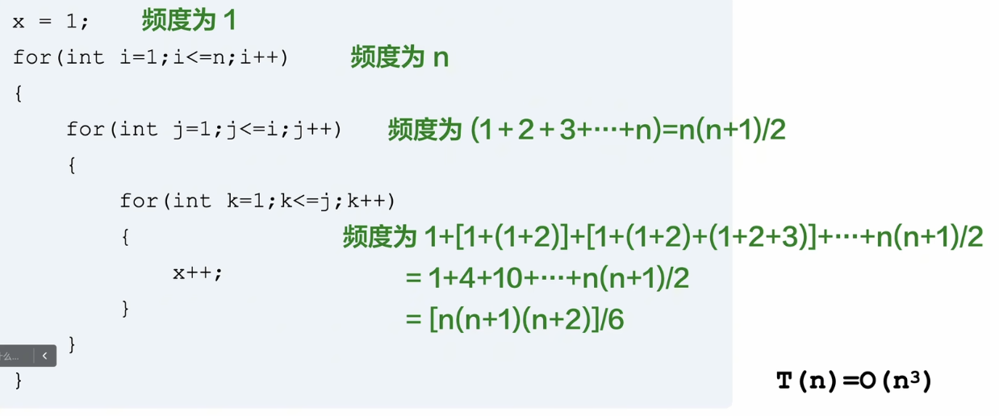
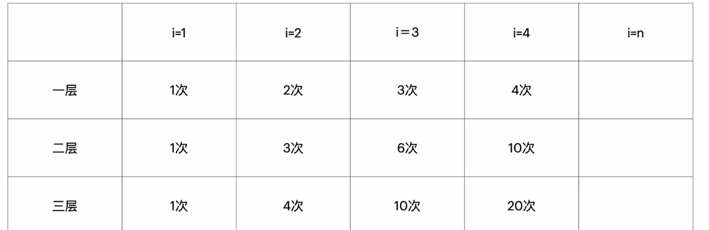
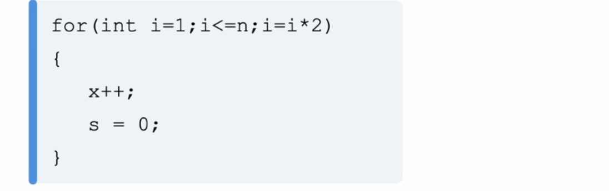
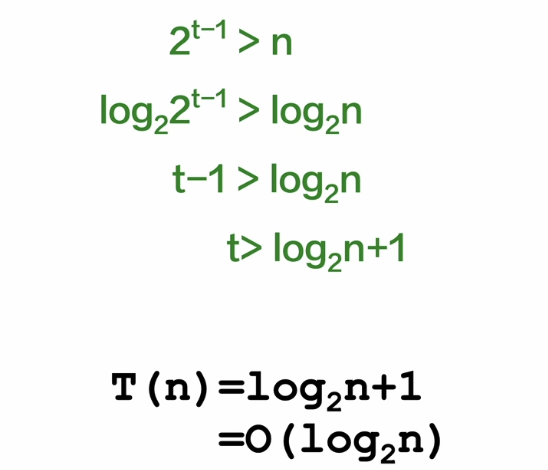
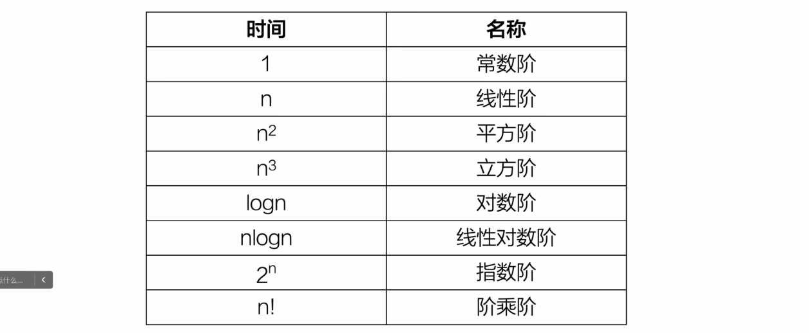
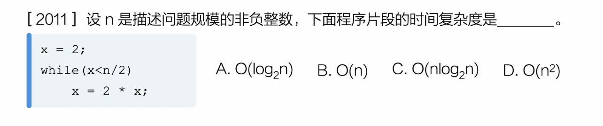
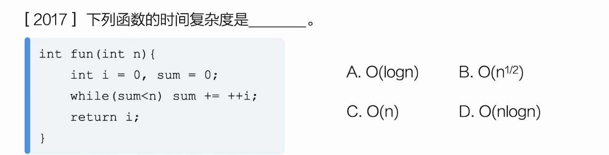
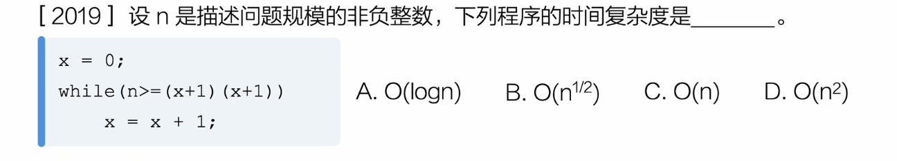
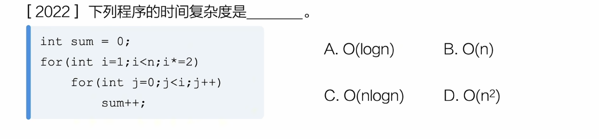

# 复杂度 详解

## 常数阶

## 线性阶

## 平方阶

## 立方阶

分析：  i = n的时候，第二层执行n次，所以第二层从一开始累加到n

可以画出如下的表格来分析：

## 对数阶

结束条件：2^(t-1) = n  👉 t = log2(n) + 1

所以时间复杂度就是O( log2(n) )

---

> 实战环节

结束条件：x = 2^(t-1) = n/2 ，也就是t = log2(n) 的时间复杂度，选A

结束条件：sum = t*(t+1)/2 = n ，也就是 t = 根号n 的时间复杂度，选B

| 次数 | 1 | 2 |    t    |
| :--: | - | - | :------: |
|  i  | 1 | 2 |    t    |
| sum | 1 | 3 | 1+2+..+t |

结束条件：n = (t+1)^2 ，也就是t = 根号n 的复杂度，选B

| 次数       | 1       | 2       | t       |
| ---------- | ------- | ------- | ------- |
| x          | 1       | 2       | t       |
| (x+1)(x+1) | (1+1)^2 | (2+1)^2 | (t+1)^2 |

实际上就是x每次自增，结束条件是n = (x+1)^2

复杂度分析：

| 第一层 | 2^(t-1) = n | log2(n) |
| ------ | ----------- | ------- |

|      次数      | 1   | 2   | t       |
| :------------: | --- | --- | ------- |
|       i       | 2^0 | 2^1 | 2^(t-1) |
| 内层执行的次数 | 2^0 | 2^1 | 2^(t-1) |

内层总共执行次数是累加第二行的结果，

所以时间复杂度是t = 2^0 + 2^1 + .. + 2^(log2(n)-1) = 2^0 + 2^1 + .. +  2^log2(n)  = 1*(1-2^log2(n))/(1-2) = n-1 = n

所以，

| 第二层 | n |
| ------ | - |

最终复杂度以最大的为准， 也就是O(n)，选B
